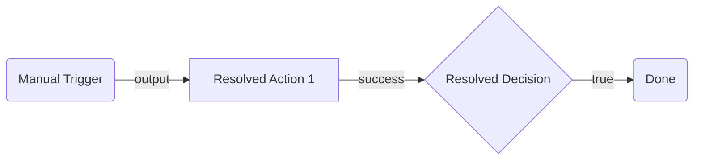

# Planning Phase 2: Implementation Resolution

Resolve every implementation detail in the approved `.uipath.flow.arch.plan.md` and produce a build-ready `.uipath.flow.impl.plan.md`, using plugin `impl.md` files, wiring rules, and flow patterns.

> **Prerequisite:** The user must explicitly approve `.uipath.flow.arch.plan.md` before this phase.
>
> **Always validate with the registry**, including OOTB nodes. Port names, required inputs, and output schemas can change.

## Implementation Resolution Process

### Step 1 — Identify Nodes and Validate with Registry

Scan the approved architectural-plan node table and connector summary. Classify every node:

| Category | Identification | Action |
|---|---|---|
| Connector | Type starts with `uipath.connector.*`, or Notes say `connector:` | Run Step 2 with [connector/impl.md](plugins/connector/impl.md). |
| Resource | Type starts with `uipath.core.*`, or Notes say `resource:` | Run Step 3 with the relevant plugin: [rpa](plugins/rpa/impl.md), [agent](plugins/agent/impl.md), [agentic-process](plugins/agentic-process/impl.md), [flow](plugins/flow/impl.md), [api-workflow](plugins/api-workflow/impl.md), or [hitl](plugins/hitl/impl.md). |
| Mock | Type is `core.logic.mock` | Run Step 4. |
| OOTB | All other nodes, including Script, HTTP, Decision, and Loop | Run Step 1a with the relevant plugin `impl.md`. |

Validate **all nodes** through the registry before proceeding.

#### Step 1a — Validate All Node Types with Registry

For each node type, read its plugin `impl.md`, then run:

```bash
uip maestro flow registry pull --force
uip maestro flow registry get <node-type> --output json
```

Use these plugin mappings:

| Node type | Plugin |
|---|---|
| `core.action.script` | [script/impl.md](plugins/script/impl.md) |
| `core.action.http.v2` | [http/impl.md](plugins/http/impl.md) |
| `core.action.transform` | [transform/impl.md](plugins/transform/impl.md) |
| `core.logic.delay` | [delay/impl.md](plugins/delay/impl.md) |
| `core.logic.decision` | [decision/impl.md](plugins/decision/impl.md) |
| `core.logic.switch` | [switch/impl.md](plugins/switch/impl.md) |
| `core.logic.loop` | [loop/impl.md](plugins/loop/impl.md) |
| `core.logic.merge` | [merge/impl.md](plugins/merge/impl.md) |
| `core.control.end` | [end/impl.md](plugins/end/impl.md) |
| `core.logic.terminate` | [terminate/impl.md](plugins/terminate/impl.md) |
| `core.subflow` | [subflow/impl.md](plugins/subflow/impl.md) |
| `core.trigger.scheduled` | [scheduled-trigger/impl.md](plugins/scheduled-trigger/impl.md) |
| `core.trigger.conversation` | [conversational-agent/impl.md](plugins/conversational-agent/impl.md) |
| `uipath.agent.conversational` | [conversational-agent/impl.md](plugins/conversational-agent/impl.md) |
| `uipath.conversational.wait-for-message` | [conversational-agent/impl.md](plugins/conversational-agent/impl.md) |
| `uipath.conversational.send-message` | [conversational-agent/impl.md](plugins/conversational-agent/impl.md) |
| `uipath.conversational.get-conversation-context` | [conversational-agent/impl.md](plugins/conversational-agent/impl.md) |
| `core.trigger.voice` | [inline-voice-agent/impl.md](plugins/inline-voice-agent/impl.md) |
| `core.action.queue.*` | [queue/impl.md](plugins/queue/impl.md) |
| `core.datafabric.*` | [data-fabric/impl.md](plugins/data-fabric/impl.md) |
| `uipath.agent.autonomous` | [inline-agent/impl.md](plugins/inline-agent/impl.md) |
| `uipath.agent.voice` | [inline-voice-agent/impl.md](plugins/inline-voice-agent/impl.md) |
| `uipath.conversational.voice.create-outgoing-call` | [inline-voice-agent/impl.md](plugins/inline-voice-agent/impl.md) |
| `uipath.conversational.voice.end-call` | [inline-voice-agent/impl.md](plugins/inline-voice-agent/impl.md) |
| `uipath.core.agent.*` | [agent/impl.md](plugins/agent/impl.md) |
| `uipath.core.rpa-workflow.*` | [rpa/impl.md](plugins/rpa/impl.md) |
| `uipath.core.agentic-process.*` | [agentic-process/impl.md](plugins/agentic-process/impl.md) |
| `uipath.core.flow.*` | [flow/impl.md](plugins/flow/impl.md) |
| `uipath.core.api-workflow.*` | [api-workflow/impl.md](plugins/api-workflow/impl.md) |
| `uipath.core.hitl.*` | [hitl/impl.md](plugins/hitl/impl.md) |
| `uipath.ixp.*` | [ixp/impl.md](plugins/ixp/impl.md) |
| `uipath.connector.*` | [connector/impl.md](plugins/connector/impl.md) |
| `uipath.connector.trigger.*` | [connector-trigger/impl.md](plugins/connector-trigger/impl.md) |

For every node, record input port names for edge `targetPort`, output port names for edge `sourcePort`, fields where `required: true` in `inputDefinition`, and the `outputDefinition` schema. Update the node table when registry values differ from the planning guide.

### Step 2 — Resolve Connector Nodes

For each connector node, follow the Configuration Workflow in [connector/impl.md](plugins/connector/impl.md), including connection binding, metadata retrieval, field resolution, and validation. Record the connection ID and resolved field values for the build.

### Step 3 — Resolve Resource Nodes

For each RPA process, agent, flow, API workflow, or human-task node, follow its plugin discovery and validation steps. Run:

```bash
uip maestro flow registry get "<node-type>" --output json
```

Record `inputDefinition` and `outputDefinition` in the node table.

If Phase 1 marked a resource not found, use in-solution discovery first. Run from the flow project directory:

```bash
uip maestro flow registry list --local --output json
uip maestro flow registry search "<resource-name>" --local --output json   # keyword match when the list is long
```

For a sibling project in the same `.uipx` solution, run:

```bash
uip maestro flow registry get "<node-type>" --local --output json
```

If it is not in the solution, run:

```bash
uip maestro flow registry pull --force
uip maestro flow registry search "<resource-name>" --output json
```

If neither source finds it, retain `core.logic.mock` and record the gap.

#### IxP nodes — context-dispatched, no bindings

IxP extraction nodes (`uipath.ixp.*`) skip binding resolution. At build time, emit design-time `folderKey` and `modelName` into the BPMN `model.context[]` array; the serializer pins `digitizationMode` to `"fileUpload"`. Do not put these in `bindings_v2.json`, a top-level `bindings[]`, or a connection binding.

Use `inputs.*` as the runtime source of truth and validate it against `registry get` `inputDefinition.properties`. Each node must carry structured `inputs.model` extraction-model metadata read by the `ixp-model-taxonomy` property-panel component. Copy `inputDefaults.model` verbatim; omitting it crashes the panel with `Cannot destructure property 'modelName' of 't' as it is undefined`. See [plugins/ixp/impl.md](plugins/ixp/impl.md) for the full JSON shape.

### Step 4 — Replace Mock Nodes

For each `core.logic.mock` node:

1. Run `uip maestro flow registry list --local --output json`, or run `uip maestro flow registry search "<name>" --local --output json` for a keyword match.
2. If found locally, replace the mock with the in-solution resource type and update inputs and outputs.
3. If not found locally, run `uip maestro flow registry search "<name>" --output json`.
4. If published, replace the mock with the real resource type and update inputs and outputs.
5. If absent from both, retain the mock and record it in **Open Questions** for user resolution.

### Step 5 — Replace Placeholders

Update the architectural-plan node table:

- Replace `<PLACEHOLDER>` values with resolved IDs.
- Replace `connector: <service>` with actual node types.
- Replace `resource: <name>` with actual node types.
- Add resolved reference-field values to inputs.
- Derive outputs from registry `outputDefinition`, mirroring both keys and their `source`; an invented `source` can pass `flow validate` but resolve to null at runtime.

### Step 6 — Write the Implementation Plan

Create `<SolutionName>.uipath.flow.impl.plan.md` beside `.uipath.flow.arch.plan.md` in the solution directory.

#### Output Format

````markdown
# <SolutionName> Implementation Plan

## Summary

2-3 sentences describing the end-to-end flow and what this phase resolved: connector bindings, confirmed resources, and registry validations.

## Flow Diagram (Mermaid)

Copy the mermaid diagram from `.uipath.flow.arch.plan.md`; update labels if mock replacement or connector resolution changes node types. Keep the same flow structure as the architectural visual reference.



## Resolved Node Table

| # | Node ID | Name | Node Type | Inputs | Outputs | Connection ID | Notes |
|---|---|---|---|---|---|---|---|

## Resolved Edge Table

Copy from `.uipath.flow.arch.plan.md`; update only if node IDs changed due to mock replacement.

## Bindings

| Connector Key | Connection ID | Activity | Verified |
|---|---|---|---|

## Global Variables

Copy the architectural plan's Inputs and Outputs section.

## Changes from Architectural Plan

- List changes between `.uipath.flow.arch.plan.md` and this plan.
- Record connector resolutions, mock replacements, and node-type changes.
- Record port or input-field changes found during registry validation.

## Open Questions

Prefix every question with `**[REQUIRED]**` or `**[OPTIONAL]**`. If none remain, write: `No open questions — all details resolved.`

- **[REQUIRED]** Which connection should be used for the connector?
- **[OPTIONAL]** Should the retry count be increased from the default?
````

Add these architectural-plan columns: **Connection ID** (bound connection UUID for connector nodes) and **Verified** (whether the connection was pinged successfully).

### Step 7 — Get Approval

Present a short chat summary containing:

1. Registry validation results, confirming all OOTB ports and inputs match the plan.
2. Number of resolved connector/resource nodes.
3. Port or input-field changes found during validation.
4. Remaining mock placeholders.
5. Required fields needing user input.
6. Connections needing creation.

Tell the user to review `<SolutionName>.uipath.flow.impl.plan.md`, including its updated mermaid diagram and registry confirmations. Do not build until the user explicitly approves.

## Product Heuristics

These org-wide selection rules complement individual node descriptions.

### Connecting to External Services

See [planning-arch.md — Selecting External Service Nodes](planning-arch.md#selecting-external-service-nodes) for the four-tier order: connector -> HTTP within connector -> standalone HTTP -> RPA.

### Agent Nodes vs Workflow Logic

See [agent/planning.md](plugins/agent/planning.md) for the decision table:

- Use **agent nodes** for ambiguous input, reasoning, judgment, NLG, and similar tasks.
- Use **Script/Decision/Switch** for structured input, deterministic logic, and data transformation.
- Do not use an agent where Decision + Script is sufficient; agents are slower, more expensive due to LLM tokens, and less predictable.
- Use the hybrid pattern: workflow nodes fetch, transform, and route; agent nodes classify intent, draft responses, or extract entities.

## Expressions and Variables

For declaration, types, scoping, updates, and expressions, see [variables-and-expressions.md](../shared/variables-and-expressions.md).

### Quick Reference

Nodes communicate through `$vars`; downstream nodes access outputs as `$vars.{nodeId}.{outputProperty}`.

```javascript
$vars.rollDice.output.roll              // Script return value
$vars.fetchData.output.body             // HTTP response body
$vars.fetchData.output.statusCode       // HTTP response status
$vars.someNode.error.message            // Error information
$vars.<loopId>.currentItem              // Loop item inside loop body
```

Prefixes:

- `=js:` is a full JavaScript expression evaluated by Jint, such as `=js:$vars.count > 10`.
- `{ }` performs string interpolation, such as `Order {$vars.orderId} is {$vars.status}`.

Variable directions in `variables.globals`:

- `in`: external, read-only after start.
- `out`: workflow output; map it on End nodes.
- `inout`: state variable updated through `variableUpdates`.

## Wiring Rules

### Port Compatibility

- Connect a source output port to a target input port.
- Source handles have `type: "source"`; target handles have `type: "target"`.
- Never connect two source ports or two target ports.

### Connection Constraints

Nodes may enforce handle constraints:

| Constraint | Meaning |
|---|---|
| `minConnections: N` | Handle requires at least N edges; otherwise validation fails. |
| `maxConnections: N` | Handle accepts at most N edges. |
| `forbiddenSourceCategories: ["trigger"]` | The handle cannot receive connections from trigger nodes. |
| `forbiddenTargetCategories: ["trigger"]` | The output cannot connect to trigger nodes. |

Additional rules:

- Trigger nodes have only outgoing connections and no input port.
- End/Terminate nodes have only incoming connections and no output port.
- Control-flow outputs generally cannot loop to triggers.
- Decision and Switch nodes cannot receive connections from agent resource nodes.

### Dynamic Ports

Some ports are configuration-generated:

- **HTTP Request:** one port per `branches` entry, named `branch-{id}`; see [http/impl.md](plugins/http/impl.md).
- **Switch:** one port per `cases` entry, named `case-{id}`; see [switch/impl.md](plugins/switch/impl.md).
- **Loop:** `success` fires after completion; `output` carries aggregated results; see [loop/impl.md](plugins/loop/impl.md).

When wiring a dynamic port, its ID must equal the configured item's `id`.