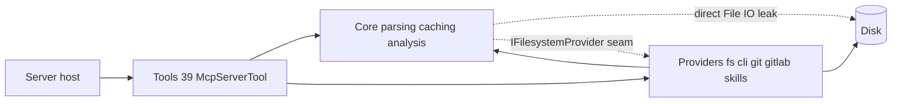

# Principal Engineer Review: UiPath Engineering MCP

Scope: whole repo at `7d2dc60` (115 commits, 2026-07-24 to 2026-09-05). I read the host, config, providers, caching, parsers, key tools, CI, scripts, and docs first-hand, and four parallel reviewers covered the rest; every top-tier claim below was re-verified in source. Assumption for prioritization: this is a single-user Dev Tunnel POC heading toward broader use, exactly as the README says.

Overall: this is a well-built codebase for its stage. The architecture is sound, the security posture is deliberate, and the test ratio (~1:1) is unusual for a POC. The problems are concentrated in a few places: workflow identity, cache invalidation in production, write fidelity, and an error contract that is 80% consistent. None require a rewrite.

## 1. Top 10 improvements (ranked by impact / effort)

**1. Flip `validate_project` default `build` to `false`** — effort XS, impact high
[ValidateProjectTool.cs:32](src/UiPath.Engineering.Mcp.Tools/ValidateProjectTool.cs) defaults `build = true` while the tool's own description, README, `agent-connection.md`, and `copilot-studio-agent-instructions.txt` all say "ALWAYS pass build:false". Three documents exist to work around one default. Terminal history shows `uip` costs 24–91 s per validate plus an update check that can hang; every omitted flag burns minutes. Flip the default, delete the workaround prose, keep `build:true` / `compile_project` as the explicit authoritative path.

**2. Fix workflow identity: bare file name is used as the key everywhere** — effort S–M, impact very high
[ProjectModelBuilder.cs:52](src/UiPath.Engineering.Mcp.Core/Models/Parsing/ProjectModelBuilder.cs) sets `FileName = Path.GetFileName(xamlPath)`. [DependencyGraphBuilder.cs:30,40](src/UiPath.Engineering.Mcp.Core/Parsing/DependencyGraphBuilder.cs) keys the graph on it and resolves the raw `WorkflowFileName` attribute (`Framework\InitAllSettings.xaml` in REFramework) against it with no normalization. Result on the project type this server explicitly targets: every framework invoke is an "Unresolved workflow invocation" risk, every framework workflow is an `orphan-workflow` gap, and the Copilot loop is instructed to remediate those gaps before `done`. Meanwhile [XamlCodedInvokeBoundary.cs:29](src/UiPath.Engineering.Mcp.Core/GapAnalysis/XamlCodedInvokeBoundary.cs) and [ProjectGapAnalyzer.cs:48](src/UiPath.Engineering.Mcp.Core/GapAnalysis/ProjectGapAnalyzer.cs) normalize with `Path.GetFileName` — the codebase disagrees with itself. Same-name workflows in two folders collide via `TryAdd`. Fix: add `RelativePath` (project-relative, `/`-normalized) to `WorkflowModel`; key graph, `ProjectAnalysisView.workflowFile` lookup ([:34-40](src/UiPath.Engineering.Mcp.Core/Models/Parsing/ProjectAnalysisView.cs)), and gaps on it; resolve `TargetWorkflow` against the project root; fall back to bare-name match with a warning. Add tests for `Framework\X.xaml`, `./X.xaml`, and duplicate basenames.

**3. C# analysis cache never invalidates on `dotnet restore` in production** — effort S, impact medium-high
[CSharpAnalysisCache.cs:142-148](src/UiPath.Engineering.Mcp.Core/CodeAnalysis/CSharpAnalysisCache.cs) stats NuGet folders through `_filesystem.GetLastWriteTimeUtc`, which calls `EnsureAllowed` ([FilesystemProvider.cs:139](src/UiPath.Engineering.Mcp.Providers/Filesystem/FilesystemProvider.cs)). `~/.nuget/packages` is outside `AllowedRoots`, so it throws `UnauthorizedAccessException`, which `SafeGetWriteTicks` swallows to a constant `0`. The docstring's own stated failure mode ("a stale partial/syntax-only compilation would be served forever") is the actual behavior, and the sliding TTL means a hot project never expires. The regression tests pass because [FakeFilesystemProvider.cs:19,43](tests/UiPath.Engineering.Mcp.Core.Tests/FakeFilesystemProvider.cs) never enforces the allow-list. Fix: stat NuGet folders inside `NuGetReferenceResolver` (it already does direct IO by design), and make the fake enforce `AllowedRoots` so this class of divergence is caught.

**4. `project.json` fidelity and single write path** — effort XS–S, impact medium
[ProjectJsonPatcher.cs:26](src/UiPath.Engineering.Mcp.Core/Docs/ProjectJsonPatcher.cs) and [CreateCodedWorkflowTool.cs:89](src/UiPath.Engineering.Mcp.Tools/CreateCodedWorkflowTool.cs) serialize with the default STJ encoder, so `é`, `&`, `'`, `+`, `<` in descriptions become `\u00E9`-style escapes on every rewrite (noisy diffs for any Portuguese-language project). `CreateCodedWorkflowTool` also hand-rolls `entryPoints` (duplicating `ProjectJsonPatcher.AddEntryPoint`, without its dedupe) and writes the `.cs` before `project.json` with no rollback. Fix: one shared `JsonSerializerOptions` with `JavaScriptEncoder.UnsafeRelaxedJsonEscaping`; route the workflow branch through `AddEntryPoint`; register first or delete the file on failure.

**5. Atomic, encoding-preserving writes in `FilesystemProvider`** — effort S, impact medium
[FilesystemProvider.cs:148-151](src/UiPath.Engineering.Mcp.Providers/Filesystem/FilesystemProvider.cs) is a direct `File.WriteAllText` (UTF-8 no BOM, non-atomic). Studio writes `.xaml`/`.cs` with a BOM, so every `edit_workflow_file` silently strips it; a crash mid-write truncates a workflow. Ten writers use this path, while [ImplementationPlanStore.cs:53-57](src/UiPath.Engineering.Mcp.Core/Planning/ImplementationPlanStore.cs) already does temp+`File.Move(overwrite)` but bypasses the provider entirely. Fix: `WriteAllText` detects existing BOM and newline style, writes a temp file, then moves; route the plan store through the provider.

**6. CLI robustness trio** — effort S each, impact medium
(a) [UiPathCliProvider.cs:257](src/UiPath.Engineering.Mcp.Providers/UiPathCli/UiPathCliProvider.cs) sets `Success = run.ExitCode == 0` and ignores parsed envelope errors — an exit-0 `Result: "Error"` reports success with populated `Errors`. Require exit 0 AND no parsed errors. (b) [ProcessRunner.CreateStartInfo](src/UiPath.Engineering.Mcp.Providers/ProcessRunner.cs) never sets `StandardOutputEncoding`/`StandardErrorEncoding`; through the `cmd.exe` shim, accented diagnostics decode as mojibake. Pin UTF-8. (c) [ActivityCatalogResolver.SafeFindAsync:319-326](src/UiPath.Engineering.Mcp.Core/Authoring/ActivityCatalogResolver.cs) and [CliActivityDiscovery.cs:22-40](src/UiPath.Engineering.Mcp.Providers/UiPathCli/CliActivityDiscovery.cs) `catch { return []; }`, so a failed discovery silently relabels the catalog `project-packages` and valid activities get rejected as unknown. Surface a warning on `validate_activity_spec`/`insert_activities` when discovery failed. Also consider an `Environment` map on `UiPathCliOptions` — terminal history shows `uip` running "Checking for updates… npm view timed out after 8s" on every call.

**7. One exception boundary, one error contract** — effort M (mechanical), impact medium-high for the LLM UX
22 of 39 tools have a try/catch, 17 don't. [AnalyzeProjectTool.cs:39](src/UiPath.Engineering.Mcp.Tools/AnalyzeProjectTool.cs), [CreateCodedWorkflowTool.cs:50](src/UiPath.Engineering.Mcp.Tools/CreateCodedWorkflowTool.cs), and `ManageProjectDocsTool.cs:73` leak `ex.Message` despite `McpToolErrorMapper`'s stated contract. `ValidateProject`, `CompileProject`, `VerifyWork`, `ExplainWorkflow`, `CreateProject`, `RunUiPathCli` build `ToolResult` by hand; [ProjectResources.cs:76-158](src/UiPath.Engineering.Mcp.Tools/ProjectResources.cs) returns bare strings. Enum-like args (`kind`, `mode`, `detail`, `action`, `expressionLanguage`) are validated ad hoc with mixed casing and mostly without `ToolErrorCodes`. Fix: one `AddCallToolFilter` in [McpServiceCollectionExtensions.cs](src/UiPath.Engineering.Mcp.Server/McpServiceCollectionExtensions.cs) mapping exceptions via `McpToolErrorMapper.ToToolError`; delete per-tool try/catch; add a tiny `ToolArgs.ParseEnum` helper returning `InvalidArgument` with accepted values. Then every tool description states the normal next call (only `find_activity` and `validate_activity_spec` do today).

**8. `run_ui_path_cli` bypasses the allow-list** — effort S, impact medium (leave-off surface, but tunnel-exposed)
[RunUiPathCliTool.cs:70-80](src/UiPath.Engineering.Mcp.Tools/RunUiPathCliTool.cs) only checks `workingDirectory`; `--project-dir C:\anything` inside `arguments` is never checked, and `rpa build` (classified read-only) writes `bin/obj`. Fix: tokenize, and require every token that canonicalizes to an existing path to be inside `AllowedRoots`.

**9. Replace the regex `CodedSourceFileParser` with a Roslyn syntax-only walk** — effort M, impact medium
[CodedSourceFileParser.cs](src/UiPath.Engineering.Mcp.Core/Parsing/CodedSourceFileParser.cs) is "dependency-free (regex/line-based)", but Roslyn is already a Core dependency ([Core.csproj:10](src/UiPath.Engineering.Mcp.Core/UiPath.Engineering.Mcp.Core.csproj)). It misclassifies on `class` in comments, braces in strings, nested/record classes, and `try`/`catch` anywhere in the file — producing wrong `kind` and false "missing try/catch/log" gaps that the loop then "remediates". `CSharpSyntaxTree.ParseText` + a `CSharpSyntaxWalker` needs no references, is deterministic, and keeps the same model shape behind the existing tests.

**10. Prefer `WorkflowViewState.IdRef` as the activity address** — effort S–M, impact medium
[XamlActivityLocator.cs:63-75](src/UiPath.Engineering.Mcp.Core/Parsing/XamlActivityLocator.cs) already reads `IdRef` and validate diagnostics name activities by it, yet `insert_activities`/`edit_workflow_activity` only accept structural-path IDs that shift after every insert, forcing re-`find_activity` round trips. Accept `IdRef` in `activityId` (Studio-authored XAML always has one), keep structural paths as the fallback for generated files.

## 2. Quick wins worth doing immediately

- Items 1, 4(a), and 6(b) above are each a few lines.
- [launchSettings.json](src/UiPath.Engineering.Mcp.Server/Properties/launchSettings.json) is the untouched VS template: IIS Express profiles, `launchBrowser: true` (opens a browser onto an API-only server), ports 5202/7269 vs. the documented 5000 — two sources of truth for the port. Replace with one `http` profile on 5000 and a `stdio` profile with `commandLineArgs: "--stdio"`.
- [Directory.Build.props](Directory.Build.props): add `TreatWarningsAsErrors`, `EnableNETAnalyzers`/`AnalysisLevel`, `Deterministic`, `ContinuousIntegrationBuild` (CI only).
- [ci.yml](.github/workflows/ci.yml): add `dotnet format --verify-no-changes`, NuGet cache via `setup-dotnet` `cache: true`, a `concurrency` group, `--logger trx` + artifact upload, and run the `Category=GoldenEval` trait explicitly so the eval harness is an actual gate.
- Delete `GitProvider`/`IGitProvider`/`GitStatusParser` and their tests, or wire them to a tool — nothing in `Tools/` consumes them.
- `PathPolicy.IsWithinAnyRoot` re-canonicalizes every root on every call and `TryCanonicalize` stats every path segment; fingerprinting does this for every file on every tool call (N × depth stats). Cache canonical roots in a `Lazy<string[]>` and skip `EnsureAllowed` for paths the provider enumerated itself.
- [ValidateProjectTool.cs:115](src/UiPath.Engineering.Mcp.Tools/ValidateProjectTool.cs) `catch { return []; }` on the boundary lint: add a warning instead of silently passing.
- [EditWorkflowFileTool.cs:81](src/UiPath.Engineering.Mcp.Tools/EditWorkflowFileTool.cs) `bytesWritten = updated.Length` is a char count.
- [ProjectGapAnalyzer.cs:296](src/UiPath.Engineering.Mcp.Core/GapAnalysis/ProjectGapAnalyzer.cs) `IsTestWorkflow = Contains("test")` exempts `LatestInvoices.xaml` from orphan detection and counts it as test coverage. Match `Test` prefix/suffix, `Tests/` folder, or `fileInfoCollection` membership.
- Doc drift: README says "Thirty-eight tools" but there are 39 `[McpServerTool]` methods (12 default + 27 leave-off) — generate the number or drop it; `agent-connection.md:10` cites "README §4–§5" which no longer exist; `.agents/skills/README.md` lists a `ccc` skill that is not in the skills root.
- Test hygiene: `FakeDirectoryTrees.cs` exists twice with different depth behavior, `FakeFilesystemProvider` vs `Fakes.cs` overlap, `HttpAuthEvaluatorTests` exists in both Core.Tests and Server.Tests. One `TestUtilities` project.
- `remove.ps1` prints "deleted" under `-WhatIf`.

## 3. Architectural and technical-debt concerns

- **Layering leak undermines the `IFilesystemProvider` seam.** Core does raw IO in `ImplementationPlanStore` (all persistence), `ProjectGapAnalyzer:300`, and `PathPolicy` (acceptable), plus `NuGetReferenceResolver` (acceptable, out-of-root by design). Item 3 is the direct consequence: fakes cannot catch policy divergence when production bypasses the seam.
- **Two near-identical fingerprinted decorators.** `CachingProjectModelBuilder` and `CSharpAnalysisCache` are the same 70 lines twice; extract `FingerprintedCache<T>`. Fingerprinting is two full directory walks plus N stats per tool call — fine today, but it is the hot path of every tool.
- `**BoundedCache` lock disposal is over-engineered and has a narrow race.** `TryDisposeUnusedLock`/`TryDisposeLockIfIdle` can dispose a `SemaphoreSlim` between another caller's `GetOrAdd` and `WaitAsync`. With ≤32 keys (project paths), keep the semaphores and drop the disposal dance. Also lower the Roslyn cache to 4–8 entries; compilations are retained for the full sliding TTL.
- **Tool-surface sprawl.** 39 tools with six acknowledged overlaps: `compile_project` ≈ `validate_project(build)`, `verify_work` ≈ `validate_project`+`update_plan_task`, `write_workflow_file` ≈ `edit_workflow_file`, `edit_workflow_activity` ≈ `insert_activities`, `manage_project_file` ≈ `manage_project_docs`, `generate_documentation` ≈ `explain_workflow`+`analyze_project`. The docs already say "do not use" for two of them. Retire `compile_project` and `verify_work`; fold `write_workflow_file` into `edit_workflow_file(mode=overwrite)`; keep the rest. `LeaveOffNames` is redundant with "not in `DefaultNames`". Parameter vocabulary drifts (`parentDirectory`, `workingDirectory`, `file`, `workflowFile` vs `relativePath`); a one-page tool API style guide would prevent the next drift.
- **Heuristic analyzers presented as facts.** `Contains("test")`, business-logic-by-substring (`Excel|Http|Mail|Outlook`), source-method detection on raw expression text, XAML local-name-only matching. Either attach `confidence` to gaps or word them as hints; the loop currently treats them as blockers.
- `**UiPathCliOutputParser` (492 lines) hard-codes envelope shapes** of a CLI that auto-updates. Capture fixtures from a pinned `uip` version and version the parser. `NuGetReferenceResolver.SelectVersionFolder` silently picks the highest installed version when the wanted one is missing — surface it in `analysisMode`.
- **Repo weight and provenance.** `.agents/skills` is 3.4 MB / 729 files vendored from `.uipath/.skills` (snapshot 2026-07-28), served at runtime by `list_skills`/`read_skill`, and already drifting. `docs/superpowers/plans` is 4.8k lines of implementation transcripts; `documentation/…ImplementationPlan.md` (1.4k lines) describes an older fingerprint design; `docs/skills/guided-implementation-loop/SKILL.md` duplicates the `.agents/skills` copy byte-for-byte. Pin and fetch the skill tree (or trim to what `uipath-rpa/SKILL.md` actually routes to), archive the plans, keep one copy of the loop skill.
- **Preview SDK pin.** `ModelContextProtocol 2.0.0-preview.3` forces `Logging.Abstractions 10.0.7` onto net8; the comment says stable 2.x exists. Plan the bump behind the existing host tests.
- **Security posture before multi-user.** Development bypasses auth entirely (and `launchSettings` forces Development); `/health/`* is anonymous including readiness data; no rate limiting; TOCTOU on not-yet-existing paths in `PathPolicy`. All acceptable for a single-user tunnel POC; list them as prerequisites, not today's work.

## 4. Well-designed — do not change

- [Program.cs](src/UiPath.Engineering.Mcp.Server/Program.cs) at 26 lines, one process one transport, stdio logs to stderr, composition in one extension method.
- ToolSurface filtering on both `tools/list` and `tools/call` — it is enforcement, not cosmetics — with `CopilotConnectorTools.DefaultNames` as the single source used by runtime, tests, and docs.
- `HttpAuthEvaluator`: `CryptographicOperations.FixedTimeEquals`, fail-closed on empty key, startup validation outside Development, `/health` anonymous, header values never logged.
- `PathPolicy`: reparse-point resolution, prefix-boundary compare (no `C:\proj` vs `C:\project` bug), case-insensitive on Windows.
- `ProcessRunner`: `ArgumentList` only, concurrent stdout/stderr reads, timeout vs. cancel distinguished, process-tree kill, never throws. Only encoding is missing.
- `ToolResult` + `ToolError(errorCode, message, fixHint, suggestedTool)` — the fixHint pattern is exactly right for an LLM consumer. Item 7 is about enforcing it, not changing it.
- `XamlActivityLocator` as the single ID authority for parser and editor; `If.children` = Then only; ambiguous `DisplayName` edits refuse rather than guess; unknown-activity refusal with an explicit escape hatch.
- `SpecValidator` accumulating multiple path-specific errors with fix hints; `XamlBuilder` on `XDocument` (escaping for free) with round-trip validation.
- Summary-first `analyze_project` with paging, and the honest `analysisMode` (full / partial / syntaxOnly) on Roslyn tools.
- Hand-written fakes and no mocking framework, behavior-focused tests at ~1:1 LOC, and the golden eval harness — it just needs to be a CI gate.
- Central Package Management, `Directory.Build.props`, K&R `.editorconfig`, and the discipline of pointing docs at `CopilotConnectorTools` instead of hand-copying lists.

## Next step

If you want to act on this, the natural first slice is items 1–5 plus the launchSettings/CI quick wins: all are small, independently shippable, and fix the correctness issues that affect the REFramework use case and the Copilot loop's "remediate gaps before done" contract. I can turn that slice into a design doc and implementation plan on your go-ahead.