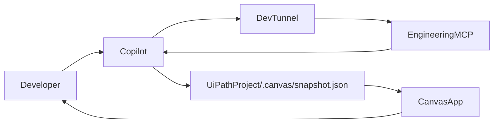

# Design: RPA comprehension canvas

Date: 2026-09-25
Status: Approved design (pending user spec review)

## 1. Purpose

An RPA developer opening an unfamiliar UiPath project gets a canvas that shows the process at workflow-file grain. The map is the invoke graph. Each workflow file has one explanation of its logic, arguments, and decisions. Those explanations already exist when the canvas opens.

Copilot writes the snapshot. It calls this Engineering MCP through the existing dev tunnel. The canvas reads the finished file and does not call Copilot, the MCP, or the UiPath project.

This server gains no tools, no endpoints, and no UI.

## 2. Decisions

- Reader: an RPA developer who already knows UiPath and does not yet know this project.
- Grain: one node per workflow file. The map stops there.
- Timing: the project overview and every workflow explanation are written before the canvas opens. Browsing never calls a model.
- Author: Copilot, using `analyze_project`, `get_workflow_dependencies`, and `explain_workflow`. The developer attaches the generation guide and asks Copilot to write the snapshot.
- App: a separate static web app. It opens `.canvas/snapshot.json` with the browser file picker.

## 3. Architecture



Facts come from tools that already exist:

- `analyze_project` with `detail=summary` — project name, `main`, workflow index, coded-workflow index.
- `get_workflow_dependencies` with no `workflowFile` — project-wide edges, argument mappings, cycles, orphans, unresolved targets. Targets are resolved against XAML workflows only.
- `explain_workflow` once per node — arguments, exception handlers, and the activity list Copilot reads while writing prose.

The canvas project owns the snapshot schema and a generation guide. The guide is self-contained: it repeats the file contract in section 4 and the steps in section 5, and it does not point at a path in this repository. The snapshot is committed inside the UiPath project so another developer can open the canvas without a tunnel.

The canvas app is its own project. It is a static single-page app built with Vite, React, and React Flow. It has no server. The chosen file is held in memory only. Reloading the page returns to the open screen.

Every id comparison in the canvas is case-insensitive. The text drawn for an id keeps the casing stored on the node.

## 4. Snapshot

Path: `<uipath-project>/.canvas/snapshot.json`.

`schemaVersion` is the JSON number `1`. The string `"1"` is refused.

Unknown properties are ignored on every object. They are not shown.

A string that is empty after trimming counts as blank for `project.overview`, node `explanation`, and edge `displayName`. The stored characters of any other string are shown unchanged.

```json
{
  "schemaVersion": 1,
  "generatedAt": "2026-09-25T18:00:00Z",
  "project": {
    "name": "VendorOnboarding",
    "entryPoint": "Main.xaml",
    "overview": "..."
  },
  "nodes": [
    {
      "id": "Framework/Process.xaml",
      "fileName": "Process.xaml",
      "kind": "xaml",
      "facts": {
        "arguments": [
          { "name": "in_Config", "direction": "In", "type": "Dictionary" }
        ],
        "hasExceptionHandler": true,
        "parseError": null
      },
      "decisions": ["Config is missing"],
      "explanation": "..."
    }
  ],
  "edges": [
    {
      "source": "Main.xaml",
      "target": "Framework/Process.xaml",
      "displayName": "Invoke Process",
      "resolved": true,
      "argumentMappings": [
        { "direction": "In", "targetArgument": "in_Config", "expression": "Config" }
      ]
    }
  ],
  "cycles": [],
  "orphans": []
}
```

### 4.1 Identity

Node `id` and `project.entryPoint` use the same project-relative form as `WorkflowPath.Identity`: `/`-separated, no absolute path, no machine path.

For an XAML workflow that id is the `relativePath` on the `analyze_project` workflow index. For a coded workflow, Copilot derives it by removing the project-path prefix from `explain_workflow`'s `filePath` and converting `\` to `/`. `filePath` itself is never written into the snapshot.

`fileName` is the file name with its extension.

Two ids that differ only by case are duplicates, and the file is refused. The refusal names the `id` of the first of those nodes.

`project.entryPoint` is the `relativePath` of the workflow index entry whose `isMain` is true. When no index entry is main, it is `main` from the summary, normalized the same way. When the project has no main, `entryPoint` is `""`.

### 4.2 Nodes

A node is every XAML workflow in the workflow index, plus every coded file whose `kind` from `analyze_project` is `workflow` (`CodedFileKind.Workflow`). Coded files whose kind is `test` or `source` are omitted.

`kind` on the node is `xaml` or `coded-workflow`.

`facts.arguments` is copied from `explain_workflow`. Each item has `name`, `direction`, and `type`, using the tool's direction strings (`In`, `Out`, `In/Out`). For a coded workflow those are the entry arguments. The array may be empty.

`facts.hasExceptionHandler` is required on `xaml` nodes and is one of `true`, `false`, or `null`. `true` means `explain_workflow` returned a non-empty `exceptionHandlers` list. `false` means that list was empty. `null` means that workflow has not been explained yet. The property is omitted on `coded-workflow` nodes. If it is present there, the canvas ignores it.

`facts.parseError` is `null`, omitted, a blank string, or a non-empty string copied from the parser. Blank means no parse error. Any other type refuses the file. Copilot does not invent a `parseError` when `explain_workflow` fails for another reason.

`decisions` is a list of activity `displayName` values, in the order `explain_workflow` returns activities, for activities whose `type` local name is `If`, `FlowDecision`, `Switch`, `FlowSwitch`, or `Pick`. Duplicate display names stay in the list. The array is empty when none of those activities were found. A missing `decisions` property means an empty list. The panel skips blank strings in the list.

`explanation` is prose Copilot writes for that file: the logic, the arguments, and the decisions. Blank or a missing property means the explanation was not written. The activity tree and the variable list are not stored. Copilot may read them while writing the explanation.

Required on every node object: `id` (non-empty string), `fileName` (non-empty string), `kind`, `facts` (object), and `facts.arguments` (array).

### 4.3 Edges, cycles, orphans

Edges are copied from the project-wide `get_workflow_dependencies` result. That graph contains Invoke Workflow File links only. The tool resolves targets against XAML workflows, so a coded node is an endpoint only when some edge's `source` or `target` string matches that node's id. A coded workflow with no such match has no connectors.

| Snapshot field | Tool field |
|---|---|
| `source` | `sourceWorkflow` |
| `target` | `targetWorkflow` |
| `displayName` | `displayName` |
| `resolved` | `isResolved` |
| `argumentMappings` | `argumentMappings` |

Each mapping has `direction`, `targetArgument`, and `expression`. A missing `expression` is `""`. The tool's mapping payload has no type, and the snapshot does not add one.

Required on every edge object: `source` (string), `target` (string), and `resolved` (boolean). A missing `displayName` is `""`. A missing `argumentMappings` is `[]`.

`cycles` and `orphans` are copied from that same result. A missing `cycles` or `orphans` property means an empty array. `cycles` is an array of arrays of strings. `orphans` is an array of strings.

Copilot does not invent nodes, edges, cycle members, or orphans. An `explain_workflow` error leaves that node's `explanation` blank, leaves `decisions` as `[]`, and leaves `facts.hasExceptionHandler` as `null` on an XAML node.

### 4.4 Project prose

`project.name` is the project name from `analyze_project`. It is a non-empty string.

`project.overview` is prose Copilot writes for the whole process. Blank or a missing property means the overview was not written.

`generatedAt` is an ISO-8601 UTC timestamp Copilot sets when it writes the file. A missing or non-string value still loads.

Absolute project paths, package lists, and risk lists are not stored.

## 5. Generation

The generation guide tells Copilot to do this, in order, for one project path the developer names:

1. Call `analyze_project` with `detail=summary`.
2. Call `get_workflow_dependencies` with no `workflowFile`.
3. Build a valid facts layer and write `.canvas/snapshot.json`. Each XAML node has `facts.arguments` `[]`, `facts.hasExceptionHandler` `null`, `facts.parseError` `null`, `decisions` `[]`, and `explanation` `""`. Each coded-workflow node has the same, without `hasExceptionHandler`. `project.overview` is `""`. `schemaVersion` is `1`. `generatedAt` is set. Edges, `cycles`, and `orphans` are already copied.
4. Call `explain_workflow` once per node. On success, replace that node's arguments, `parseError`, `decisions`, and `explanation` from that result, set XAML `hasExceptionHandler` to `true` or `false`, and write the file again. On failure, leave that node at its step-3 values.
5. Write `project.overview` from the summary and the per-workflow explanations, and write the file again.

A file saved at step 3 is valid. Nodes that have not been explained yet stay at the step-3 values. The guide includes the full file contract and states that prose fields are the only words Copilot authors.

## 6. Screen

Before a file is chosen, the screen offers a file picker and shows no graph. Canceling the picker stays on that screen and shows no error.

After a file loads, one screen has four regions.

**Header.** Project name, entry-point text, and snapshot time. The time is the `generatedAt` string as written. When `generatedAt` is missing or not a string, the header reads `Time not recorded`. When `entryPoint` is blank, the header reads `No entry point`. Otherwise it shows the `entryPoint` string. A control opens a different snapshot and replaces the screen. The app never writes the file.

**Overview.** `project.overview` is visible above the map before any selection. When it was not written, the region reads `Overview was not written.`

**Map.** A pan-and-zoom graph. Edges are drawn even when their ends sit in different regions. An edge with `resolved` `false` is dashed. An edge with `resolved` `true` is solid, including when one end is a placeholder. Several edges may share the same source and target; each one is drawn and can be selected on its own. Arrows run from caller to callee.

The main region is a top-down hierarchy, and it is omitted when `entryPoint` matches no node. When `entryPoint` matches a node, that node is the root and carries the text `Entry point`, including when it has no outgoing edges and including when it is a coded workflow. It does not carry an orphan mark. Depth is the shortest path from that root along resolved edges that end at a real node. An edge that would revisit a node is still drawn, and it does not increase depth.

A second region, with the heading `Not reached from the entry point`, holds every real node that is not reachable from the root along those resolved edges, plus every placeholder from section 7. The heading is omitted when the region is empty. A node listed in `orphans` that is reachable from the root stays in the main region and carries the text `Orphan`, except the root. A node listed in `orphans` that is not reachable carries `Orphan` in the second region. A node whose id appears in `cycles` carries the text `Cycle`. A coded workflow whose id matches no edge endpoint is in the second region, unless it is the root.

When `entryPoint` matches no node, no node carries `Entry point`, the header still shows the entry-point string, and every real node and placeholder is in the second region.

A placeholder is labeled with the unmatched id string and carries the text `Missing`.

An empty `nodes` array is valid. The overview still shows, and the map has no nodes.

A file-name filter matches a real node's `fileName`, or a placeholder's full id label, by case-insensitive substring. An empty filter shows every node at full strength. A node that does not match is dimmed. An edge is dimmed only when both ends are dimmed; an edge with one matching end stays at full strength. Dimmed nodes stay visible and selectable.

**Panel.** Clicking the map background clears the panel. The overview stays.

Selecting a real node shows:

- kind, as the text `XAML` or `Coded workflow`
- `explanation`, or the text `Explanation was not written.`
- `parseError` when it is a non-empty string
- arguments as a table of name, direction, and type
- each decision display name
- for `xaml` only: `Exception handler: yes`, `Exception handler: no`, or `Exception handler was not loaded.` when the flag is `null`
- callers and callees taken from edges, including unresolved ones: the other end's `fileName`, or the placeholder's id, and the edge `displayName`

Choosing a caller or callee selects that node and brings it into the visible map.

Selecting an edge shows its `displayName`, or the text `Invoke` when that is blank, then source, target, the text `Resolved` or `Unresolved`, and the argument mappings as direction, target argument, and expression.

Selecting a placeholder shows the text `This file is not in the snapshot.`

## 7. Failures

The app refuses a file it cannot trust, names the reason on the open screen, and draws nothing from that file. The reason includes the substring below.

- The contents are not a JSON object. Substring: `not a JSON object`.
- `schemaVersion` is missing or is not the number `1`. Substring: `schemaVersion`.
- `project` is missing or is not an object, `project.name` is missing or blank, or `entryPoint` is missing or is not a string. Substring: `project`.
- `nodes` or `edges` is missing or is not an array. Substring: `nodes` or `edges`, matching the field that failed.
- A `nodes` or `edges` item is not an object. Substring: `nodes` or `edges`.
- A node lacks a non-empty string `id` or `fileName`, lacks `kind`, `kind` is not `xaml` or `coded-workflow`, `facts` is missing or not an object, or `facts.arguments` is not an array. Substring: that node's `id` when it is a non-empty string, otherwise `nodes`.
- An `xaml` node lacks `facts.hasExceptionHandler`, or that value is not `true`, `false`, or `null`. Substring: that node's `id`.
- An argument object lacks `name`, `direction`, or `type`, or any of those is not a string. Substring: the owning node's `id`.
- `facts.parseError` is present and is neither `null` nor a string. Substring: that node's `id`.
- `decisions`, when present, is not an array of strings. Substring: that node's `id`.
- An edge lacks `source` or `target` as strings, or lacks boolean `resolved`. Substring: `edges`.
- A mapping object lacks string `direction` or string `targetArgument`. Substring: `edges`.
- `cycles`, when present, is not an array of arrays of strings. Substring: `cycles`.
- `orphans`, when present, is not an array of strings. Substring: `orphans`.
- Two nodes share an id under case-insensitive comparison. Substring: the first node's `id`.

A file that passes those checks still draws when something inside it is missing:

- Blank `overview` or `explanation`: the screen shows the not-written sentence from section 6.
- An edge `source` or `target`, or an `orphans` entry, that matches no node id: a placeholder in the unconnected region. Cycle entries that match no node are skipped and do not create placeholders.
- Non-empty `parseError`: that message is shown on the node.
- Missing `generatedAt`: the header reads `Time not recorded`.

The app does not call the MCP and does not parse XAML to fill gaps.

## 8. Checks

Loader checks are Vitest tests over fixture JSON. Screen checks are Playwright tests over one valid fixture. No live UiPath project and no Copilot.

The valid fixture is this graph. `project.name` is `VendorOnboarding`. `project.overview` is `Vendor onboarding starts in Main.` `project.entryPoint` is `Main.xaml`.

- `Main.xaml`, `kind` `xaml`, explanation `Main dispatches the transaction.`, argument `in_Config` / `In` / `String`, decision `Config is missing`, `hasExceptionHandler` `true`.
- `Process.xaml`, reachable from `Main.xaml`, `explanation` `""`, `hasExceptionHandler` `false`, `decisions` `[]`.
- `Broken.xaml`, reachable from `Main.xaml`, explanation `Broken reads the queue.`, `parseError` `could not read file`, `hasExceptionHandler` `false`.
- `Unused.xaml`, in `orphans`, no incident edge, explanation `Unused is not called.`, `hasExceptionHandler` `false`.
- `Report.cs`, `kind` `coded-workflow`, no incident edge, explanation `Report posts the outcome.` The `hasExceptionHandler` property is omitted.
- Resolved edges: `Main.xaml` → `Process.xaml`, `Main.xaml` → `Broken.xaml`, `Process.xaml` → `Broken.xaml`, `Broken.xaml` → `Process.xaml`.
- `cycles` contains `["Process.xaml", "Broken.xaml"]`.
- One unresolved edge: `Main.xaml` → `Missing.xaml`, mapping `In` / `in_Config` / `Config`.
- `Missing.xaml` is not a node.

Loader checks also accept an otherwise valid file whose XAML node has `facts.hasExceptionHandler` `null`.

Refusal fixtures, each asserting the substring in section 7: a JSON array, `schemaVersion` as the string `"1"`, two nodes whose ids differ only by case, and a missing `nodes` array.

Screen checks on the valid fixture:

- The overview text is visible before a node is selected.
- `Main.xaml` shows `Entry point`.
- Selecting `Main.xaml` shows `Main dispatches the transaction.`, `in_Config`, and `Config is missing`.
- Selecting the unresolved edge shows `in_Config`, `Config`, and the text `Unresolved`.
- `Unused.xaml` and `Report.cs` appear under the heading `Not reached from the entry point`. `Unused.xaml` shows `Orphan`. `Report.cs` shows `Coded workflow` when selected.
- `Process.xaml` and `Broken.xaml` show `Cycle` and stay in the main region.
- The edge to `Missing.xaml` is dashed, and `Missing.xaml` shows `Missing`.
- Filtering by `Process` leaves `Process.xaml` at full strength and dims `Main.xaml`.
- Choosing the callee `Process.xaml` from `Main.xaml` selects `Process.xaml`.
- `Process.xaml` shows `Explanation was not written.`
- `Broken.xaml` shows `could not read file`.

## 9. Out of scope

- Any change to this MCP server.
- Navigation into activities or logic blocks. Activity trees are read during generation and are not stored.
- Editing a workflow, writing the snapshot, or calling Copilot from the canvas.
- Coded source files and coded test files on the map.
- Inferring an edge from a coded method call. Only Invoke Workflow File edges from `get_workflow_dependencies` are drawn.
- Remembering the last opened file across a reload.
